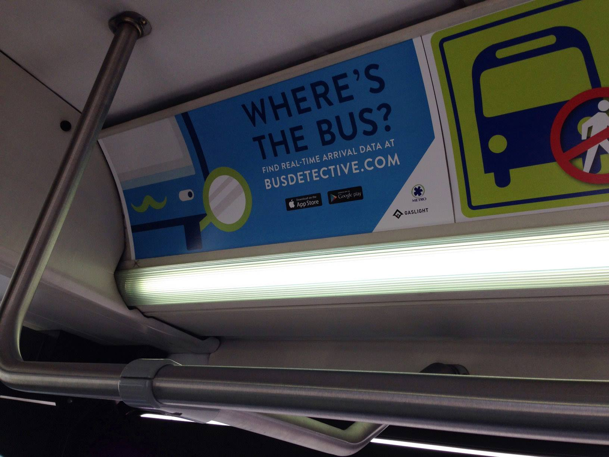

## Hi!
* I'm Chris
* I'm from Gaslight
* I do apprenticeship and other stuff

---

## Agenda
* A brief history of Bus Detective
* Learn you a GTFS
* The rewrite
* How Elixir helped
* How Web Components helped

---

## What's a Bus Detective?
* In February 2015, Gaslight moved downtown
* It was cold and people wanted to know when their bus would actually get there
* Kevin Rockwood discovered a GTFS feed for Metro
* He wrote some code...

---

## What's a GTFS feed?
* General Transit Feed Specification
* Spec for Transit agencies to publish their data
* How Google Maps gets pubtran info

---

## GTFS Static
* Routes
* Stops
* Times
* Calendars
* Fare rules
* zipfile of CSV (http)

---

## GTFS Realtime
* Trip updates
* Vehicle positions
* Service alerts
* Protocol Buffers over http

---

## Let's build a Rails app
* And you always need a JS framework...
* EmberJS
* Cordova = native apps

---

## It grows into a Thing
* Increasing usage
* Metro adopts it
* Ads on busses

---



---

## Monetization is hard :(
* Ideas didn't quite pan out
* 0 revenue is hard to sustain
* Led to some loss of interest

---

## Problems we had
* Performance
* Client side polling
* Hosting $
* Picking a JS framework

---

## The rewrite
* Tim got tired of seeing the error page
* Plan was to just rewrite importer in Elixir
* It kinda got out of hand :)

---

## [Bus Detective NG](https://app.busdetective.com)
* Elixir
* Web Components
* Moving busses
* PWA

---

## Why Elixir
* Language
* Framework
* Platform

---

## Elixir
* Functional language
* Immutability
* Ruby inspired syntax
* Easy transition

---

## My Favorite Elixir Features
* Pattern matching
* Pipeline operator

---

## Pattern matching
```elixir
  def show(conn, params) do
    case parse_params(params) do
      {:ok, stop_id_params, options} ->
        load_stop(conn, stop_id_params, options)

      error ->
        error
    end
  end
```

---

## Pattern matching in function head
```elixir
  defp load_stop(conn, [stop_id], _options) do
    ...
  end

  defp load_stop(conn, [feed_id, stop_remote_id], options) do
    ...
  end

```

---

## Pipeline operator
```elixir
  defp find_exact_stop_time_update(
         %TripUpdate{stop_time_update: stop_time_updates},
         stop_sequence
       ) do
    stop_time_updates
    |> Enum.filter(&(is_nil(&1.stop_sequence) || &1.stop_sequence == stop_sequence))
    |> Enum.at(0)
    |> StopTimeUpdate.from_message()
  end
```

---

## Phoenix
* MVC Web framework for Elixir
* Inspired by Rails
* Ohio Made!
* Channels

---

## Elixir platform
* Erlang VM
* Designed for telco (Ericcson)
* 20+ yrs old

---

## OTP
* Open Telephony Platform
* High concurrency
* High availability
* Distributed

---

## OTP ideas
* Processes
* Supervisors
* Applications
* Let it Crash!

---

## Bus Detective NG
* OTP Umbrella App
* Bus Detective
* Bus Detective Web
* Importer
* Realtime

---

## GenServer
* A stateful process
* Responds to messages
* Managed by supervisors

---

## Responding to a message
```elixir
  def handle_call(
        {:find_stop_time, trip_remote_id, stop_sequence},
        _,
        %{realtime_data: realtime_data} = state
      ) do
    stop_time_update =
      StopTimeUpdateFinder.find_stop_time_update( realtime_data, trip_remote_id, stop_sequence)

    {:reply, {:ok, stop_time_update}, state}
  end
```

---

## Realtime Application
```elixir
  def start(_type, _args) do
    children =
      [
        {Registry, keys: :unique, name: TripUpdates},
        {Registry, keys: :unique, name: VehiclePositions},
        {Registry, keys: :duplicate, name: Registry.Realtime, id: Registry.Realtime}
      ] ++ trip_updates_children() ++ vehicle_positions_children()

    opts = [strategy: :one_for_one, name: Realtime.Supervisor]

    Supervisor.start_link(children, opts)
  end
```

---

## Elixir wins
* So fast
* No polling
* upsert
* No architecture!

---

## What about the front end?

---

## EmberJS
* Very powerful
* Very opinionated
* Stay on top of upgrades
* We didn't :(

---

## Front-end rewrite
* Gave up on EmberJS :(
* Moved everything to SSR
* Sprinkled in some javascript
* Refactored to Web Components

---

## I like Web Components!
* Make your own HTML elements
* v1 now implemented in Chrome and Firefox
* and since IE is going to Chrome... :)

---

```javascript
class Timestamp extends HTMLElement {
  get timestamp () {
    return this.getAttribute('timestamp');
  }

  get displayedTimestamp () {
    return moment(this.timestamp).fromNow();
  }

  connectedCallback () {
    const update = () => {
      this.innerHTML = this.displayedTimestamp;
      setTimeout(update, 1000);
    };
    update();
  }
}
```

---

## Please allow me to climb onto my soapbox
* Remember jQuery and Coffeescript?
* Proprietary components will join this list

---

## Things that made Web Components fun
* Keep thy components dumb
* Data passed via attributes (or props)
* Re-render on data change
* Emit custom events

---

## `wc-state-reducers`
* emits new state on custom events
* passes data to components on state change
* kinda like a lighter, simpler redux

---

## Moving busses explained 

---

### Listening for a message
```javascript
channel.on('vehicle_positions', message => {
  dispatch(document, 'updateVehiclePositions',  
    message.vehicle_positions);
  console.log('Received Vehicle Positions', message);
});
```

---

### Reducer
```javascript
const updateVehiclePositions = (state, vehiclePositions) => {
  return Object.assign({}, state, { vehiclePositions });
};
```

---

### Subscriber
```javascript
'bd-stop-map': 
  (
    { mapExpanded, vehiclePositions, tripShapes },
    element
  ) => {
    ...
    element.setAttribute('vehicle-positions',
    JSON.stringify(vehiclePositions));
  }
```

---

### StopMap vehiclePositions accessor
```javascript
  get vehiclePositions () {
    return this.getAttribute('vehicle-positions')
      ? JSON.parse(this.getAttribute('vehicle-positions')) : [];
  }
```

---

### Rendering on the map
```javascript
this.vehiclePositions.forEach((vehiclePosition) => {
  ...
  let busMarker = Leaflet.marker([vehiclePosition.latitude, vehiclePosition.longitude], {icon: busIcon});
  busMarker.bindTooltip(
    `
    <div class="map-bus-label" 
      style="background-color: #${vehiclePosition.route_color}; color: #${vehiclePosition.route_text_color};">
      ${vehiclePosition.route_name}
    </div>
  `,
    {permanent: true, direction: 'top'});
  busMarker.addTo(this.map);
});
```

---

## It's open source!
[github.com/bus-detective/bus_detective_ng](https://github.com/bus-detective/bus_detective_ng)

---

## Also check out [open-wc.org](http://open-wc.org)
* project generators
* testing
* LitElement

---

## Stuff we didn't get to
* Cordova
* PWA
* Load your own city!


